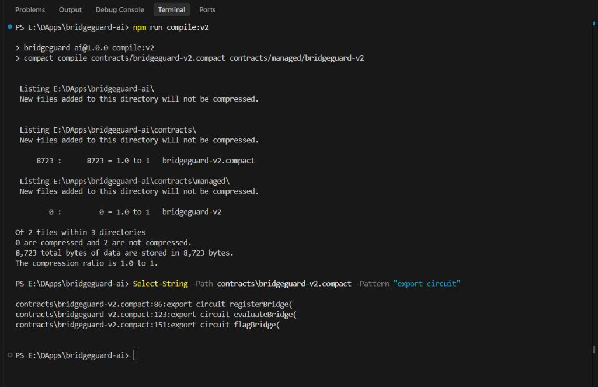
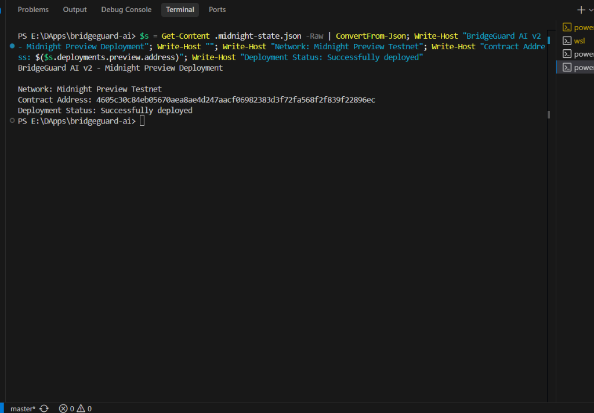
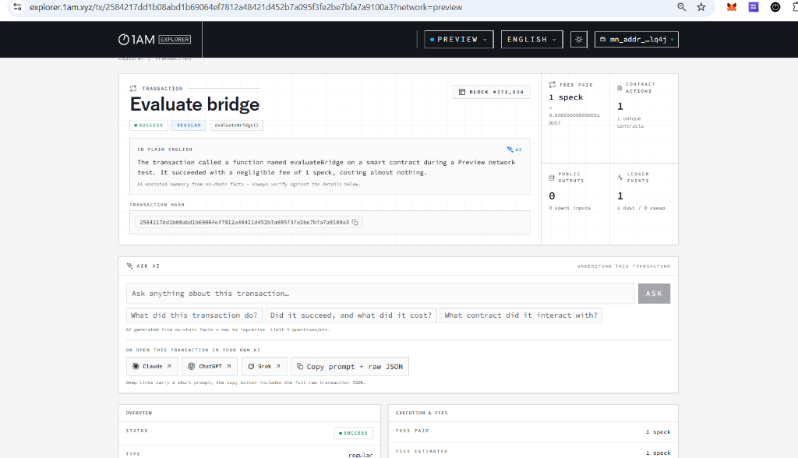

# BridgeGuard AI v2

**Privacy-preserving bridge risk evaluation on the Midnight Preview Testnet.**

BridgeGuard AI is a decentralized bridge risk evaluation system built on the Midnight Network using Compact Smart Contracts, React, TypeScript, and the Midnight.js SDK. Users can evaluate cross-chain bridge risk using public bridge information combined with sensitive user inputs inside a Midnight Zero-Knowledge circuit, and write only a coarse risk verdict to the public ledger. Under this model, the backend acts as a trusted prover and sees the private inputs (amount, maxRisk, and intel) during transaction preparation. However, these sensitive inputs remain undisclosed on the public blockchain ledger, and only the coarse verdict and tolerance-fit result are written on-chain as public ledger state.

> **Important:** BridgeGuard AI is **NOT itself a cross-chain bridge.** It does **not** transfer assets from one chain to another. The actual asset transfer is performed by the selected external cross-chain bridge. BridgeGuard AI works as a security / risk-evaluation layer that runs *before* the bridge is used.

---

## 🎯 What This Does

BridgeGuard AI evaluates bridge risk using **public bridge information** (TVL, audit status, incident counter, and status) combined with **sensitive user inputs** (private transfer amount and private risk tolerance) inside a **Midnight Zero-Knowledge circuit**, writing only a coarse risk verdict (`LOW / MEDIUM / HIGH / CRITICAL`) and a tolerance-fit result to the public ledger.

---

## ✨ Features

* 🔒 **Zero-Knowledge Privacy**: Evaluates bridge risk without revealing the exact transfer amount, user risk tolerance, or private intelligence witness on-chain.
* 🌉 **Bridge Registry**: Register bridges with public security parameters (TVL, audited, incident count).
* ⚖️ **Private ZK Evaluation**: Run the `evaluateBridge()` circuit to verify if a bridge meets the user's risk tolerance.
* 🚨 **Incident Prevention**: Allows operators to flag bridges or mark them compromised in real time via the `flagBridge()` circuit.
* 🌐 **Persistent UI**: React SPA with persistent 1AM Wallet connection via the official Midnight DApp Connector API.
* ⚡ **Node.js REST API**: Backend API acts as the trusted prover for ZK proof generation.
* 🧪 **Comprehensive Tests**: 16/16 smart contract simulator tests passing.

---

## 💡 Initial Product Idea

Users who want to move assets across chains need to judge whether a bridge is safe to use. Simply asking a public service "is this transfer risky?" normally means revealing sensitive evaluation inputs: the transfer amount, the user's risk tolerance, and confidential intelligence feeds. BridgeGuard AI solves this by keeping these sensitive inputs off-chain, computing a secure liability/exposure score compared to bridge TVL inside a private ZK circuit, and disclosing only a simple, coarse public verdict tier on-chain.

---

## 📜 Contract Address

| Network | Contract Address |
| --- | --- |
| **Preview** | `4605c30c84eb05670aea8ae4d247aacf06982383d3f72fa568f2f839f22896ec` |
| **Preprod** | Not deployed |

---

## 🏗️ Architecture

```
  React Frontend (Vite)
        │
        ▼
  REST API Server (Node.js) ──▶ 1AM Wallet (Signs and submits)
        │
        ├─── Midnight JS SDK ──▶ Midnight Preview Network (RPC / Indexer)
        │                              │
        │                        Compact Smart Contract
        │                        (bridgeguard-v2.compact)
        │
        └─── ZK Proof Server (Docker) — generates ZK proofs locally
```

---

## 🔐 Privacy Model

The Compact smart contract separates what is public on-chain from what remains private as a zero-knowledge witness.

### Public — visible on-chain

| Field / State | Type | Description |
| --- | --- | --- |
| **bridges** | Set / Mapping | Public bridge registry (name, chains, TVL, audited status, incident count, and status) |
| **verdicts** | Mapping | Coarse verdict per evaluation and tolerance-fit state |
| **disclosed verdict** | Enum | Coarse verdict tier (`LOW / MEDIUM / HIGH / CRITICAL`) |
| **within tolerance** | Boolean | Whether the evaluation passed the user's risk tolerance |

### Private — not revealed in on-chain state

| Element | Input Type | Description |
| --- | --- | --- |
| **amount** | Private Input | The exact transfer amount used in the evaluation |
| **maxRisk** | Private Input | The user's risk tolerance from 0 to 3 |
| **intel** | Private Witness | The confidential intelligence feed obtained via the private witness `getRiskIntel()` from private state |

### What the user proves without revealing

The `evaluateBridge()` circuit proves that combining the public bridge parameters with the user's private inputs (`amount` and `maxRisk`) and the confidential `intel` witness yields a specific coarse verdict tier (`LOW`, `MEDIUM`, `HIGH`, `CRITICAL`) and whether the risk is within the user's tolerance (`within`), without disclosing the exact amount, risk tolerance, or intelligence witness.

---

## 🛠️ Tech Stack

| Layer | Technology |
| --- | --- |
| **Smart Contract** | Compact (Midnight DSL v0.23, `contracts/bridgeguard-v2.compact`) |
| **Blockchain** | Midnight Preview Testnet |
| **Frontend** | React 18 + TypeScript + Vite 6 + Tailwind CSS |
| **Backend** | Node.js + REST API (`src/server.ts`) |
| **Wallet** | 1AM Wallet via Midnight DApp Connector API (`window.midnight`) |
| **ZK Proofs** | Midnight Proof Server (Docker, port 6300) |
| **Testing** | Vitest (`tests/bridgeguard.test.ts`) |

---

## 🚀 Getting Started

### Prerequisites

* **Node.js** >= 22
* **Docker Desktop** (with WSL2 integration enabled)
* **1AM Wallet** browser extension (set to Preview Testnet)
* **Compact compiler** (from Midnight Developer Hub)

### Install

```bash
git clone https://github.com/prakashakalbhor/BridgeGuard.git
cd BridgeGuard
npm install
npm --prefix frontend install
```

### Start Infrastructure (Docker)

```bash
docker compose up -d --wait
```

This starts the `midnight-proof-server` at `http://127.0.0.1:6300` for local proof generation.

### Compile the Smart Contract

```bash
npm run compile:v2
```

Exposed circuits:
* `registerBridge()`
* `evaluateBridge()`
* `flagBridge()`

### Start the API Server

```bash
npx tsx src/server.ts
```

### Start the Frontend

```bash
npm run frontend:dev
```

Then open `http://localhost:5173`.

### Deploy to Preview Testnet

```bash
npx tsx src/deploy-v2.ts --network preview
```

---

## ✅ Running Tests

```bash
npm test
```

Expected output:

```
✓ tests/bridgeguard.test.ts (16 tests)
Test Files  1 passed (1)
    Tests  16 passed (16)
```

Test coverage includes:
- `registerBridge`: stores public bridge metadata and derives its public base risk score.
- `evaluateBridge`: evaluates bridge risk from TVL and confidential intel feed, verifies privacy boundaries.
- `flagBridge`: updates the security status of a bridge (ACTIVE, FLAGGED, COMPROMISED) under authority signature.
- **Privacy boundary verification**: asserts that the exact `amount`, `maxRisk`, and `intel` never appear in the ledger state or transaction proof.

---

## 🌐 Deployment Status

| Feature | Status |
| --- | --- |
| Smart Contract | ✅ Deployed |
| Midnight Preview Testnet | ✅ Deployed |
| Contract Address | `4605c30c84eb05670aea8ae4d247aacf06982383d3f72fa568f2f839f22896ec` |
| REST API | 🧪 Verified locally / production currently initializing |
| React Frontend | 🚀 Deployed on Vercel |
| ZK Proof Generation | 🧪 Verified locally |
| Wallet Integration | 🧪 Verified on Midnight Preview |

---

## 🔄 Full User Flow

1. **Connect Wallet** — Connect the 1AM Wallet (Preview Testnet) in the UI.
2. **Select Bridge** — Select a registered bridge route from the public registry.
3. **Risk Evaluation** — Input transfer amount, maximum risk tolerance, and private intel.
4. **Generate Proof** — The backend prepares the unsealed transaction and generates the ZK proof using the proof-server.
5. **Wallet Signing & Fees** — The 1AM Wallet balances the transaction, pays the DUST fee, prompts the user for approval, and submits it to Midnight Preview.
6. **On-chain Verdict** — The transaction writes the coarse verdict on-chain and the frontend reads it back for display.

---

## 🔐 Why Zero-Knowledge Proofs?

Traditional financial verification systems force the user to reveal transaction values and sensitive parameters publicly. BridgeGuard AI uses Zero-Knowledge Proofs to let users compute and verify the risk verdict match against set thresholds on-chain, proving compliance and regulatory alignment without exposing exactly what amount was scrutinized or revealing the confidential intel signals that led to the verdict.

---

# Hackathon Submission Evidence

## 1. Compact Contract Compilation

- **Command**: `npm run compile:v2`
- **Network**: Midnight Preview
- **Exported circuits**:
  - `registerBridge()`
  - `evaluateBridge()`
  - `flagBridge()`
- **Compilation**: **PASS**

---

## 2. Midnight Preview Deployment

- **Contract**: **BridgeGuard AI v2**
- **Network**: **Midnight Preview**
- **Contract Address**: `4605c30c84eb05670aea8ae4d247aacf06982383d3f72fa568f2f839f22896ec`

---

## 3. Successful On-chain Evaluation

- **Circuit**: `evaluateBridge()`
- **Wallet**: **1AM**
- **Status**: **SucceedEntirely**
- **Block**: **371834**
- **DUST Fee**: **1 speck**
- **Verdict**: **MEDIUM**
- **Within tolerance**: **true**
- **Transaction**: `2584217dd1b08abd1b69064ef7812a48421d452b7a095f3fe2be7bfa7a9100a3`

---

## 4. Evidence Screenshots

- **Compact compilation output**
  

- **Midnight Preview deployment with contract address**
  

- **Successful `evaluateBridge()` transaction on 1AM Explorer**
  

---

## 5. Live Demo

**Live Demo**: [Open BridgeGuard AI v2 Demo]([Live Demo URL to be added]) (To be added)

---

## 6. Demo Video

The video will demonstrate:
1. 1AM wallet connection
2. Bridge Analysis
3. Private risk evaluation
4. Wallet transaction approval
5. DUST fee payment
6. Successful on-chain confirmation
7. On-chain verdict

**Demo Video**: [To be added]

---

## 7. Evidence Summary Table

| Evidence | Status |
|---|---|
| Compact v2 compilation | PASS |
| Exported circuits: registerBridge, evaluateBridge, flagBridge | PASS |
| Midnight Preview deployment | PASS |
| Deployed contract address documented | PASS |
| 1AM wallet connection | PASS |
| Wallet-signed evaluateBridge() | PASS |
| DUST fee paid by wallet | PASS |
| On-chain transaction confirmation | PASS |
| ZK private-input evaluation | PASS |
| On-chain coarse verdict | PASS |

---

## 📂 Project Structure

```
bridgeguard-ai/
├── contracts/
│   ├── bridgeguard-v2.compact        # Midnight Compact contract source
│   └── managed/bridgeguard-v2/       # Compiled artifacts, ZKIR, prover/verifier keys
├── frontend/
│   ├── vite.config.ts                # Vite dev server + /api proxy
│   └── src/
│       ├── pages/
│       │   ├── BridgeAnalysis.tsx    # ZK evaluation UI (wallet-signed + fallback)
│       │   └── WalletConnection.tsx  # Wallet connect/disconnect UI
│       ├── hooks/useWallet.tsx       # Wallet state hooks
│       ├── services/
│       │   ├── wallet.ts             # 1AM detection + DApp Connector session
│       │   ├── midnight.ts           # Contract SDK layer & wallet-signed evaluations
│       │   └── api.ts                # Backend API client
│       └── utils/riskEngine.ts       # Risk score definitions
├── src/
│   ├── server.ts                     # Node backend & trusted prover
│   ├── witnesses-v2.ts               # Private state witnesses
│   └── deploy-v2.ts                  # Deploy pipeline
├── tests/
│   └── bridgeguard.test.ts           # Vitest contract simulator suite
├── package.json
└── docker-compose.yml                # Proof server config
```

---

## 🔐 Production Deployment (Render & Vercel)

For production/demo hosting under Level 2, the app is deployed in a decoupled architecture:

### A. Frontend UI (Vercel)
* **Hosting:** Deployed as a static single-page app (SPA).
* **Build Command:** `npm run frontend:build`
* **Output Directory:** `frontend/dist`
* **Environment Variables:**
  * `VITE_API_BASE`: Set to the public URL of the deployed Render backend (do not enter any wallet seeds or keys here).

### B. Backend API (Render Web Service)
* **Hosting:** Deployed as a persistent web service container on Render using the root `Dockerfile`.
* **Private State Sync:** LevelDB state is kept inside the container.
* **Environment Variables (Render Environment Variables):**
  * `MIDNIGHT_WALLET_MNEMONIC`: The 24-word recovery phrase for the service wallet on Preview.
  * `PRIVATE_STATE_PASSWORD`: Encryption key (min 16 chars) to seal the private database on disk.
  * `MIDNIGHT_CONTRACT_ADDRESS`: The active contract address (`4605c30c84eb05670aea8ae4d247aacf06982383d3f72fa568f2f839f22896ec`).
  * `MIDNIGHT_PROOF_SERVER_URL`: Set to the Render private/internal URL of the proof server (e.g., `http://proof-server:6300` using the Render internal DNS alias).
  * `PORT`: Automatically assigned by Render.
  * `NODE_ENV`: `production`

### C. Proof Server (Render Private Service)
* **Hosting:** A separate private service container deployed on Render using the public image `midnightntwrk/proof-server:8.1.0` with the start command `midnight-proof-server -v`.
* **Port Configuration:** Expose port `6300` internally via private networking. **Do NOT generate a public domain** or expose port `6300` to the internet. The backend connects through the Render private/internal hostname provided by Render.

---

## ⚠️ Important Limitations

* The **backend acts as a trusted prover** and sees the private inputs during transaction preparation.
* The project protects sensitive inputs from **public ledger disclosure**; it does not claim end-to-end browser-only privacy.
* **AI / risk analysis and ZK proof generation are separate responsibilities.** The AI Transfer Advisor is a transparent rule-based decision-support engine — it does not generate ZK proofs and is not backed by an LLM. The Midnight circuit and proving infrastructure generate the proofs.
* The confidential intel feed is currently user-provided through the UI; it is not yet connected to an external intelligence provider.

---

## 🔮 Future Scope

* Wire a real confidential incident-intelligence provider to feed the `getRiskIntel` witness automatically.
* Add a whale-transfer monitoring circuit or an indexer-derived whale feed.
* Richer indexer-driven analytics: verdict trending, liquidity history, cross-bridge anomaly detection.
* Deploy to preprod/mainnet using the same `deploy-v2.ts` flow.
* Optional AI-assisted explanation layer on top of the disclosed verdicts.

---

*BridgeGuard AI — a privacy-preserving bridge risk evaluation DApp built on Midnight.*
