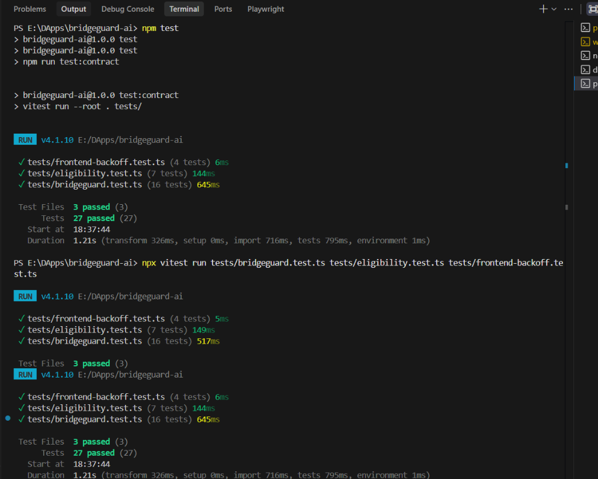

# ZeroBridge

**Privacy-preserving security for cross-chain DeFi on the Midnight Network (Preview & Preprod Testnets).**

ZeroBridge is a decentralized bridge risk evaluation system built on the Midnight Network using Compact Smart Contracts, React, TypeScript, and the Midnight.js SDK. Users can evaluate cross-chain bridge risk using public bridge information combined with sensitive user inputs inside a Midnight Zero-Knowledge circuit, and write only a coarse risk verdict to the public ledger. The zero-knowledge proof is generated locally in the browser through the connected Midnight wallet via the Midnight.js SDK; the private inputs (amount, maxRisk, and intel) never leave the user's device and are never sent to the backend. Only the coarse verdict and tolerance-fit result are written on-chain as public ledger state.

> **Important:** ZeroBridge is **NOT itself a cross-chain bridge.** It does **not** transfer assets from one chain to another. The actual asset transfer is performed by the selected external cross-chain bridge. ZeroBridge works as a security / risk-evaluation layer that runs *before* the bridge is used.

---

## 🌐 Live Demo & Midnight Deployments

**Live Demo:** [Open ZeroBridge Demo](https://bridge-guard-umber.vercel.app/)

| Level | Network | Contract Address | Purpose |
| --- | --- | --- | --- |
| **Level 1** | Midnight Preview | `4605c30c84eb05670aea8ae4d247aacf06982383d3f72fa568f2f839f22896ec` | Earlier Level 1 deployment |
| **Level 2** | Midnight Preprod | `24cdec3db0408077d9f2b0cd484b29bef5e4c2e0bac4f11d3f5ef24a5e25dc8c` | Current Level 2 submission |

**Confirmed Preprod deployment transaction:**

```text
a2d5d8370fab068fb95780cc40895a99c277a837bdc69a188ed404a8498cce1c
```

> **Level 2 submission:** The **Midnight Preprod** deployment is the deployment used for the current Level 2 submission/demo. The Midnight Preview deployment remains available as the earlier testnet deployment.

---

## 🎯 What This Does

ZeroBridge evaluates bridge risk using **public bridge information** (TVL, audit status, incident counter, and status) combined with **sensitive user inputs** (private transfer amount and private risk tolerance) inside a **Midnight Zero-Knowledge circuit**, writing only a coarse risk verdict (`LOW / MEDIUM / HIGH / CRITICAL`) and a tolerance-fit result to the public ledger.

---

## ✨ Features

* 🔒 **Zero-Knowledge Privacy**: Evaluates bridge risk without revealing the exact transfer amount, user risk tolerance, or private intelligence witness on-chain.
* 🌉 **Bridge Registry**: Register bridges with public security parameters (TVL, audited, incident count).
* ⚖️ **Private ZK Evaluation**: Run the `evaluateBridge()` circuit to verify if a bridge meets the user's risk tolerance.
* 🚨 **Incident Prevention**: Allows operators to flag bridges or mark them compromised in real time via the `flagBridge()` circuit.
* 🌐 **Persistent UI**: React SPA with persistent Midnight wallet connection (1AM preferred, Lace supported) via the official Midnight DApp Connector API.
* ⚡ **Node.js REST API**: Backend API serves public registry/ledger state (deployment tooling only; it is not a prover).
* 🖥️ **Browser-Local Proving**: ZK proofs are generated locally in the browser through the connected Midnight wallet via the Midnight.js SDK — no server-side proof generation.
* 🧪 **Comprehensive Tests**: 16/16 smart contract simulator tests passing.

---

## 💳 Wallet Integration

ZeroBridge connects to Midnight wallets through the official **Midnight DApp Connector API** injected into `window.midnight`. Compatible wallets are detected dynamically by capability, rdns and display name — no single wallet vendor is hard-coded.

For the current **Level 2 Midnight Preprod** testing the wallet selection priority is:

1. **1AM** — preferred when both 1AM and Lace are available.
2. **Lace** — remains fully supported as a fallback.
3. **Any other compatible Midnight wallet** — used as a further fallback.

---

## 💡 Initial Product Idea

Users who want to move assets across chains need to judge whether a bridge is safe to use. Simply asking a public service "is this transfer risky?" normally means revealing sensitive evaluation inputs: the transfer amount, the user's risk tolerance, and confidential intelligence feeds. ZeroBridge solves this by keeping these sensitive inputs off-chain, computing a secure liability/exposure score compared to bridge TVL inside a private ZK circuit, and disclosing only a simple, coarse public verdict tier on-chain.

---

## 🏗️ Architecture

```
  React Frontend (Vite)
        │
        ├── 1AM / Lace Wallet (proves + signs + submits locally)
        │         │
        │         ├── Midnight JS SDK (dappConnectorProofProvider)
        │         └── ZK artifacts served from /zk (prover keys + ZKIR)
        │                     │
        ▼                     ▼
  REST API Server (Node.js)   Midnight Network (RPC / Indexer)
        │                     │
        └── registry/state   Compact Smart Contract
                             (bridgeguard-v2.compact)
```

---

## 🔐 Privacy Model

The Compact smart contract separates what is public on-chain from what remains private as a zero-knowledge witness.

### Public — visible on-chain

| Field / State | Type | Description |
| --- | --- | --- |
| **bridges** | Set / Mapping | Public bridge registry (name, chains, TVL, audited status, incident count, and status) |
| **verdicts** | Mapping | Coarse verdict per evaluation and tolerance-fit state |
| **disclosed verdict** | Enum | Coarse verdict tier (`LOW / MEDIUM / HIGH / CRITICAL`) |
| **within tolerance** | Boolean | Whether the evaluation passed the user's risk tolerance |

### Private — not revealed in on-chain state

| Element | Input Type | Description |
| --- | --- | --- |
| **amount** | Private Input | The exact transfer amount used in the evaluation |
| **maxRisk** | Private Input | The user's risk tolerance from 0 to 3 |
| **intel** | Private Witness | The confidential intelligence feed obtained via the private witness `getRiskIntel()` from private state |

### What the user proves without revealing

The `evaluateBridge()` circuit proves that combining the public bridge parameters with the user's private inputs (`amount` and `maxRisk`) and the confidential `intel` witness yields a specific coarse verdict tier (`LOW`, `MEDIUM`, `HIGH`, `CRITICAL`) and whether the risk is within the user's tolerance (`within`), without disclosing the exact amount, risk tolerance, or intelligence witness.

---

## 🛠️ Tech Stack

| Layer | Technology |
| --- | --- |
| **Smart Contract** | Compact (Midnight DSL v0.23, `contracts/bridgeguard-v2.compact`) |
| **Blockchain** | Midnight Network (Preview & Preprod Testnets) |
| **Frontend** | React 18 + TypeScript + Vite 6 + Tailwind CSS |
| **Backend** | Node.js + REST API (`src/server.ts`) |
| **Wallet** | Midnight wallets (1AM preferred, Lace supported) via Midnight DApp Connector API (`window.midnight`) |
| **ZK Proofs** | Browser-local via Midnight wallet + Midnight.js SDK (dappConnectorProofProvider / FetchZkConfigProvider) |
| **Testing** | Vitest (`tests/bridgeguard.test.ts`) |

---

## 🚀 Getting Started

### Prerequisites

* **Node.js** >= 22
* **Docker Desktop** (with WSL2 integration enabled)
* **Midnight Wallet (1AM or Lace)** browser extension — 1AM is preferred for the current Level 2 Preprod testing; Lace remains supported as a fallback.
* **Compact compiler** (from Midnight Developer Hub)

### Install

```bash
git clone https://github.com/prakashakalbhor/BridgeGuard.git
cd BridgeGuard
npm install
npm --prefix frontend install
```

### Start Infrastructure (Docker)

```bash
docker compose up -d --wait
```

This starts the `midnight-proof-server` at `http://127.0.0.1:6300`. This is **development/deployment tooling only** (e.g. the simulator tests and Node-based deploy tooling) — the production frontend generates proofs locally in the browser and never calls the proof server.

### Compile the Smart Contract

```bash
npm run compile
```

Exposed circuits:
* `registerBridge()`
* `evaluateBridge()`
* `flagBridge()`

## Compile Verification

The Compact contracts compile successfully using:

```bash
npm run compile
```

This compiles both contracts:
- `contracts/bridgeguard.compact`
- `contracts/bridgeguard-v2.compact`

The generated compilation artifacts are committed to this repository under:
- `contracts/managed/`
  - `bridgeguard/`
  - `bridgeguard-v2/`

These directories contain the generated ZK circuit artifacts, proving keys, verifying keys, and contract metadata required to verify the compilation output.

A fresh clone can regenerate the same artifacts by running:
```bash
npm run compile
```

### Start the API Server

```bash
npx tsx src/server.ts
```

### Start the Frontend

```bash
npm run frontend:dev
```

Then open `http://localhost:5173`.

### Deploy to Preview Testnet

```bash
npx tsx src/deploy-v2.ts --network preview
```

## Deployment Evidence

### Level 2 Contract Deployment (Current Submission)

The BridgeGuard v2 contract is deployed on the Midnight Preprod Testnet (current Level 2 submission & demo deployment).

**Contract Address:**

```text
24cdec3db0408077d9f2b0cd484b29bef5e4c2e0bac4f11d3f5ef24a5e25dc8c
```

**Network:** Midnight Preprod Testnet

### Level 1 Contract Deployment (Earlier/Historical)

The BridgeGuard v2 contract was earlier deployed on the Midnight Preview Testnet (earlier/historical testnet deployment).

**Contract Address:**

```text
4605c30c84eb05670aea8ae4d247aacf06982383d3f72fa568f2f839f22896ec
```

**Network:** Midnight Preview Testnet

---

## ✅ Running Tests

```bash
npm test
```

### Test Evidence

The Level 3 test suite passes all relevant tests:

- BridgeGuard contract tests: 16 passed
- Age / Eligibility Gate tests: 7 passed
- Frontend backoff tests: 4 passed
- **Total: 27 tests passed**



Expected output:

```
 RUN  v4.1.10

 ✓ tests/frontend-backoff.test.ts (4 tests)
 ✓ tests/eligibility.test.ts (7 tests)
 ✓ tests/bridgeguard.test.ts (16 tests)

 Test Files  3 passed (3)
      Tests  27 passed (27)
```

Test coverage includes:
- `registerBridge`: stores public bridge metadata and derives its public base risk score.
- `evaluateBridge`: evaluates bridge risk from TVL and confidential intel feed, verifies privacy boundaries.
- `flagBridge`: updates the security status of a bridge (ACTIVE, FLAGGED, COMPROMISED) under authority signature.
- **Privacy boundary verification**: asserts that the exact `amount`, `maxRisk`, and `intel` never appear in the ledger state or transaction proof.

---

## 🌐 Deployment Status

| Feature | Status |
| --- | --- |
| Smart Contract | ✅ Deployed |
| Midnight Preview Testnet | ✅ Deployed |
| Midnight Preprod Testnet | ✅ Deployed |
| REST API | 🧪 Verified locally / production currently initializing |
| React Frontend | 🚀 Deployed on Vercel |
| ZK Proof Generation | 🧪 Verified locally (browser via Midnight wallet + Midnight.js SDK) |
| Wallet Integration | 🧪 Verified on Midnight Preview |

---

## 🔎 Bridge Analysis

The Bridge Analysis page runs a confidential zero-knowledge evaluation for the selected route. The latest implementation:

- Shows **only bridges matching the exact selected Source → Destination route**.
- Requires the user to **explicitly select a bridge** — the first bridge is not automatically selected.
- **Resets the selected bridge** whenever the Source or Destination chain changes.
- Shows a clear **"No bridge registered for this route"** informational state when the selected route has no registered bridge (this state is not a selectable bridge).
- Enables **Analyze** only when a bridge is selected and, in wallet-signed mode, the wallet is connected.

---

## 🔄 Full User Flow

1. **Connect Wallet** — Connect a Midnight wallet (1AM preferred on Preprod, Lace supported) in the UI.
2. **Select Bridge** — Select a registered bridge route from the public registry.
3. **Risk Evaluation** — Input transfer amount, maximum risk tolerance, and private intel.
4. **Generate Proof (in browser)** — The frontend loads the ZK artifacts (`/zk/keys` + `/zk/zkir`) and asks the connected Midnight wallet to generate the zero-knowledge proof locally via the Midnight.js SDK (`dappConnectorProofProvider`). No private input leaves the browser.
5. **Wallet Signing & Fees** — The connected Midnight wallet balances the transaction, pays the DUST fee, prompts the user for approval, and submits it to the network.
6. **On-chain Verdict** — The transaction writes the coarse verdict on-chain and the frontend reads it back for display.

---

## 🔐 Why Zero-Knowledge Proofs?

Traditional financial verification systems force the user to reveal transaction values and sensitive parameters publicly. BridgeGuard AI uses Zero-Knowledge Proofs to let users compute and verify the risk verdict match against set thresholds on-chain, proving compliance and regulatory alignment without exposing exactly what amount was scrutinized or revealing the confidential intel signals that led to the verdict.

---

# Hackathon Submission Evidence

## 1. Compact Contract Compilation

- **Command**: `npm run compile`
- **Network**: Midnight Preview
- **Exported circuits**:
  - `registerBridge()`
  - `evaluateBridge()`
  - `flagBridge()`
- **Compilation**: **PASS**

---

## 2. Midnight Preprod Deployment

- **Contract**: **BridgeGuard AI v2**
- **Network**: **Midnight Preprod Testnet**
- **Contract Address**: `24cdec3db0408077d9f2b0cd484b29bef5e4c2e0bac4f11d3f5ef24a5e25dc8c`

---

## 3. Successful On-chain Evaluation

- **Circuit**: `evaluateBridge()`
- **Wallet**: **1AM**
- **Status**: **SucceedEntirely**
- **Block**: **371834**
- **DUST Fee**: **1 speck**
- **Verdict**: **MEDIUM**
- **Within tolerance**: **true**
- **Transaction**: `2584217dd1b08abd1b69064ef7812a48421d452b7a095f3fe2be7bfa7a9100a3`

---

## 4. Evidence Screenshots

- **Compact compilation output**
  

- **Midnight Preview deployment with contract address**
  

- **Successful `evaluateBridge()` transaction on 1AM Explorer**
  

- **Level 3 Test Suite Output (27 tests passing)**
  

---

## 5. Live Demo

**Live Demo**: [Open BridgeGuard AI v2 Demo](https://bridge-guard-umber.vercel.app/)

---

## 6. Demo Video

The video will demonstrate:
1. 1AM wallet connection
2. Bridge Analysis
3. Private risk evaluation
4. Wallet transaction approval
5. DUST fee payment
6. Successful on-chain confirmation
7. On-chain verdict

**Demo Video**: []

---

## 7. Evidence Summary Table

| Evidence | Status |
|---|---|
| Compact v2 compilation | PASS |
| Exported circuits: registerBridge, evaluateBridge, flagBridge | PASS |
| Midnight Preview deployment | PASS |
| Deployed contract address documented | PASS |
| 1AM wallet connection | PASS |
| Wallet-signed evaluateBridge() | PASS |
| DUST fee paid by wallet | PASS |
| On-chain transaction confirmation | PASS |
| ZK private-input evaluation | PASS |
| On-chain coarse verdict | PASS |

---

## 📂 Project Structure

```
bridgeguard-ai/
├── contracts/
│   ├── bridgeguard-v2.compact        # Midnight Compact contract source
│   └── managed/bridgeguard-v2/       # Compiled artifacts, ZKIR, prover/verifier keys
├── frontend/
│   ├── vite.config.ts                # Vite dev server + /api proxy
│   └── src/
│       ├── pages/
│       │   ├── BridgeAnalysis.tsx    # ZK evaluation UI (wallet-signed, browser-local proving)
│       │   └── WalletConnection.tsx  # Wallet connect/disconnect UI
│       ├── hooks/useWallet.tsx       # Wallet state hooks
│       ├── services/
│       │   ├── wallet.ts             # 1AM detection + DApp Connector session
│       │   ├── midnight.ts           # Contract SDK layer & wallet-signed evaluations
│       │   ├── browserProof.ts       # Browser-local ZK proving (Midnight.js SDK)
│       │   └── api.ts                # Backend API client (registry/state only)
│       ├── shim/
│       │   └── isomorphic-ws.ts      # Browser WebSocket shim for the indexer provider
│       └── utils/riskEngine.ts       # Risk score definitions
├── src/
│   ├── server.ts                     # Node backend (registry/state, dev tooling — not a prover)
│   ├── witnesses-v2.ts               # Private state witnesses
│   └── deploy-v2.ts                  # Deploy pipeline
├── tests/
│   └── bridgeguard.test.ts           # Vitest contract simulator suite
├── package.json
└── docker-compose.yml                # Proof server config
```

---

## 🔐 Production Deployment (Render & Vercel)

For production/demo hosting under Level 2, the app is deployed in a decoupled architecture:

### A. Frontend UI (Vercel)
* **Hosting:** Deployed as a static single-page app (SPA).
* **Build Command:** `npm run frontend:build`
* **Output Directory:** `frontend/dist`
* **Environment Variables:**
  * `VITE_API_BASE`: Set to the public URL of the deployed Render backend (do not enter any wallet seeds or keys here).

### B. Backend API (Render Web Service)
* **Hosting:** Deployed as a persistent web service container on Render using the root `Dockerfile`.
* **Private State Sync:** LevelDB state is kept inside the container.
* **Backend wallet is optional:** `/api/state` and the static frontend are served even when the backend wallet is not configured or fails to sync/initialize. Wallet-dependent endpoints (`/api/balance`, `/api/register`, `/api/evaluate`, `/api/flag`, `/api/poc/*`) return `503` ("Backend wallet not ready") until the wallet is up. End-user ZK evaluations run entirely in the browser and never need the backend wallet.
* **Environment Variables (Render Environment Variables):**
  * `MIDNIGHT_WALLET_MNEMONIC`: The 24-word recovery phrase for the service wallet on Preview.
  * `PRIVATE_STATE_PASSWORD`: Encryption key (min 16 chars) to seal the private database on disk.
  * `MIDNIGHT_CONTRACT_ADDRESS`: The active contract address (`4605c30c84eb05670aea8ae4d247aacf06982383d3f72fa568f2f839f22896ec`).
  * `MIDNIGHT_PROOF_SERVER_URL`: Set to the Render private/internal URL of the proof server (e.g., `http://proof-server:6300` using the Render internal DNS alias).
  * `PORT`: Automatically assigned by Render.
  * `NODE_ENV`: `production`

### C. Proof Server (Render Private Service) — dev tooling only
* **Hosting:** A separate private service container deployed on Render using the public image `midnightntwrk/proof-server:8.1.0` with the start command `midnight-proof-server -v`.
* **Port Configuration:** Expose port `6300` internally via private networking. **Do NOT generate a public domain** or expose port `6300` to the internet. The backend connects through the Render private/internal hostname provided by Render.
* **Note:** The production frontend does **not** call the proof server. It is used only by the Node-based deployment tooling and contract tests. Production ZK proofs are generated locally in the browser via the connected Midnight wallet.

---

## ⚠️ Important Limitations

* The **frontend generates ZK proofs locally in the browser** through the connected Midnight wallet. The backend never receives the private inputs (`amount`, `maxRisk`, `intel`); it serves only public registry/ledger state.
* The Node-based backend/deploy tooling still uses the local proof server for contract deployment and simulator tests; it does not handle end-user evaluations.
* **AI / risk analysis and ZK proof generation are separate responsibilities.** The AI Transfer Advisor is a transparent rule-based decision-support engine — it does not generate ZK proofs and is not backed by an LLM. The Midnight circuit and proving infrastructure generate the proofs.
* The confidential intel feed is currently user-provided through the UI; it is not yet connected to an external intelligence provider.

---

## Level 3 — Age / Eligibility Gate

BridgeGuard now includes an **Age / Eligibility Gate** Compact contract that proves a user meets an eligibility threshold without revealing the underlying private value.

### Problem

Users need to prove they meet an eligibility threshold (e.g., age ≥ 18) without revealing the underlying private value (their actual age).

### Solution

BridgeGuard includes an `eligibility-gate.compact` contract with the following design:

- **Circuit**: `checkEligibility(value: Uint<8>)` — takes the user's private value as a circuit parameter
- **Threshold**: Hardcoded to `18` inside the circuit (not stored in ledger state)
- **Computation**: `eligible = value >= 18`
- **Disclosure**: Only the boolean `eligible` result is disclosed via `disclose()`
- **Ledger state**: `checkCount` (Counter) records number of checks; `lastEligible` (Boolean) stores the latest result
- The actual private value is **never** written to the public ledger

### Privacy Model

| Category | Fields | Description |
| --- | --- | --- |
| **PUBLIC** | `lastEligible` (Boolean) | Boolean result of the latest eligibility check |
| | `checkCount` (Counter) | Total number of eligibility checks performed |
| **PRIVATE** | `value` (Uint<8>) | User's actual age/value — never revealed |
| | `getValue()` (Witness) | Private witness supplying the value from off-chain DApp |

**What an observer CAN learn:**
- Whether the latest check was eligible (`true`/`false`)
- How many checks were performed (`checkCount`)

**What an observer CANNOT learn:**
- The user's actual age/value
- The exact private input to the circuit
- The private witness (`getValue()`) value

### Zero-Knowledge Flow

```
User private value (age)
         │
         ▼
Compact circuit (checkEligibility)
         │
         ▼
ZK proof generated locally in browser via Midnight wallet
         │
         ▼
Only boolean eligibility result disclosed on-chain
         │
         ▼
Public ledger: lastEligible + checkCount
```

### Testing

Verified test results (all passing):

| Test Suite | Tests | Status |
| --- | --- | --- |
| Eligibility tests (`tests/eligibility.test.ts`) | 7 | ✅ Passed |
| Existing BridgeGuard tests (`tests/bridgeguard.test.ts`) | 16 | ✅ Passed |
| Frontend backoff tests (`tests/frontend-backoff.test.ts`) | 4 | ✅ Passed |
| **Total relevant tests** | **27** | **✅ Passed** |

Test coverage includes:
- Boundary values: 25 (eligible), 16 (ineligible), 18 (eligible boundary), 17 (ineligible boundary)
- Privacy boundary: private value never appears in public ledger state
- Identical public state for different private values yielding same eligibility result

### CI/CD

- **GitHub Actions workflow**: `.github/workflows/ci.yml`
- **Triggers**: Push and pull_request to `main`/`master` branches
- **Steps**:
  1. Install dependencies (root + frontend)
  2. Compile all Compact contracts (`npm run compile` — includes eligibility)
  3. TypeScript type checks (root + frontend)
  4. Frontend build
  5. Test suite (`npm test` — 27 tests passing)
- **Current status**: Successful passing run on master branch

### Compiled Artifacts

The eligibility contract compiles to:

```
contracts/managed/eligibility-gate/
├── compiler/
│   └── contract-info.json
├── contract/
│   └── index.js / index.d.ts / index.js.map
├── keys/
│   ├── proving.key
│   └── verifying.key
└── zkir/
    └── eligibility-gate.bzkir
```

Generated via:
```bash
npm run compile:eligibility
# or
npm run compile  # compiles all 3 contracts
```

---

## 🔮 Future Scope

* Wire a real confidential incident-intelligence provider to feed the `getRiskIntel` witness automatically.
* Add a whale-transfer monitoring circuit or an indexer-derived whale feed.
* Richer indexer-driven analytics: verdict trending, liquidity history, cross-bridge anomaly detection.
* Deploy to Midnight mainnet using the same `deploy-v2.ts` flow.
* Optional AI-assisted explanation layer on top of the disclosed verdicts.

---

*BridgeGuard AI — a privacy-preserving bridge risk evaluation DApp built on Midnight.*
